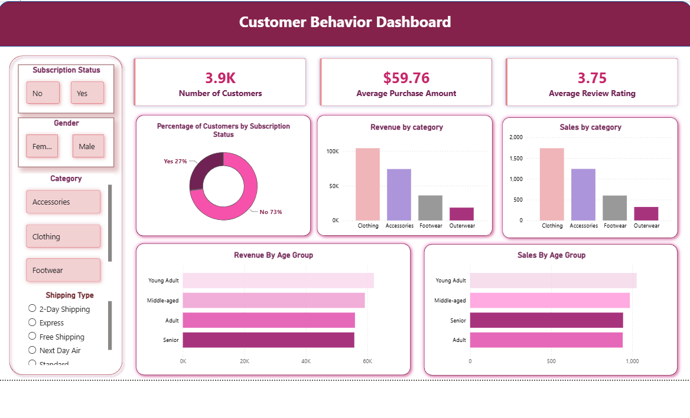

# Retail-Customer-Behavior-Analysis

An end-to-end retail analytics project that transforms raw, messy customer data into a clean dataset, deep SQL-driven analysis, and an interactive Power BI dashboard — built to reflect the complete workflow of a real-world data analyst role, from data wrangling to business storytelling.


# Overview

This project analyzes retail customer data to uncover behavioral patterns, revenue trends, and product performance. It combines data cleaning in Python, advanced querying in SQL, and interactive visualization in Power BI to generate insights that support customer retention, marketing, and sales decision-making.

# Data Cleaning & Preparation
- Cleaned and transformed **3,900+ customer records** using Python (Pandas, NumPy)
- Handled missing values, duplicate entries, and inconsistent formatting to ensure data accuracy
- Standardized column names and data types, and engineered new features (e.g., age groups, purchase frequency in days) for deeper analysis

# SQL Analysis (PostgreSQL)
- Applied **CTEs** to break complex logic into clean, readable analytical steps
- Used **window functions** for ranking customers, calculating running totals, and identifying trends over time
- Wrote **subqueries** and **aggregate functions** to summarize revenue, order frequency, and customer-level metrics
- Segmented customers into meaningful groups (e.g., high-value, frequent, at-risk) to support targeted business action
- Analyzed revenue trends across time periods to surface growth and decline patterns
- Evaluated product-level performance to identify top sellers and underperformers

#Dashboard & Visualization (Power BI)
- Designed an interactive, multi-page dashboard covering sales performance, customer behavior, and core business KPIs
- Built dynamic filters (subscription status, gender, category, shipping type) and drill-down views for self-service exploration
- Focused on clear, business-friendly visuals suitable for stakeholder presentations

#Business Impact
- Translated raw data into **actionable recommendations** for customer retention strategies
- Identified opportunities to inform **targeted marketing campaigns** based on customer segments
- Supported **sales strategy decisions** with revenue and product performance insights

---

## 🛠️ Tech Stack

| Tool | Purpose |
|------|---------|
| **Python (Pandas, NumPy)** | Data cleaning, transformation, and preprocessing |
| **PostgreSQL (SQL)** | Data analysis using CTEs, window functions, subqueries, and aggregates |
| **Power BI** | Interactive dashboard and data visualization |
| **Excel** | Supplementary data handling and validation |

---

# Repository Contents

| File | Description |
|------|--------------|
| `customer_shopping_behavior.csv` | Raw dataset used for the analysis |
| `Retail_customer_behavior_analysis.ipynb` | Python notebook — data cleaning, transformation, and feature engineering |
| `customer_behavior_sql_queries.sql` | SQL queries — CTEs, window functions, subqueries, and aggregates |
| `Retail_customer_analysis_dashboard.pbix` | Power BI dashboard file |
| `Retail_customer_behavior_dashboard.png` | Dashboard preview image |
| `README.md` | Project documentation |
| `LICENSE` | Repository license |

---

# Dashboard Preview



*The dashboard includes filters for subscription status, gender, category, and shipping type, alongside KPIs for total customers, average purchase amount, and average review rating — with revenue and sales breakdowns by category and age group.*

> 📌 To interact with the live file, download `Retail_customer_analysis_dashboard.pbix` and open it in Power BI Desktop.

---

# How to Explore This Project

1. **Data Cleaning:** Open `Retail_customer_behavior_analysis.ipynb` to see the full data cleaning and preprocessing workflow in Python.
2. **SQL Analysis:** Review `customer_behavior_sql_queries.sql` for the queries used to segment customers and analyze revenue and product trends.
3. **Dashboard:** Open `Retail_customer_analysis_dashboard.pbix` in Power BI Desktop to explore the interactive dashboard, or view the static preview above.

### Running the notebook locally
```bash
git clone https://github.com/Aasthakolhe/Retail-Customer-Behavior-Analysis.git
cd Retail-Customer-Behavior-Analysis
pip install pandas numpy
jupyter notebook Retail_customer_behavior_analysis.ipynb
```
The raw dataset (`customer_shopping_behavior.csv`) is included in this repository, so the notebook can be run end-to-end after cloning.

---

# Key Insights 

- Top 20% of customers contribute X% of total revenue
- [Product category] shows the highest growth trend over the last quarter
- Customer churn risk is highest among [segment], suggesting targeted retention campaigns

---

# Future Improvements

- Automate data pipeline with scheduled refreshes
- Add predictive modeling for customer churn
- Expand dashboard with cohort analysis

---

# Why This Project

This project was built to demonstrate a complete, industry-relevant analytics workflow — combining technical skills (Python, SQL, Power BI) with business thinking, to show not just *how* to analyze data, but *why* the insights matter.

---

## 📬 Contact

**Aastha Kolhe**
[[LinkedIn](https://www.linkedin.com/in/aastha-kolhe)](#) | [[email][aasthakolhe04@gmail.com](#)

---

⭐ If you found this project useful, consider giving it a star on GitHub!
