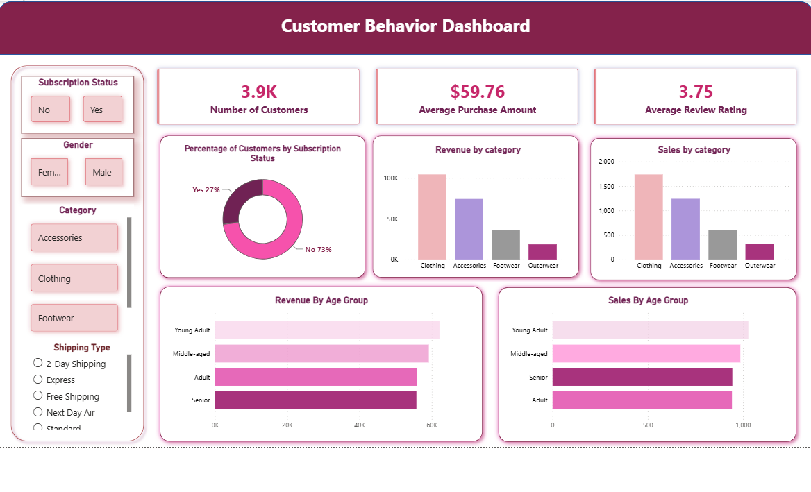

# Retail Customer Behavior Analysis

An end-to-end retail analytics project that transforms raw, messy customer data into a clean dataset, deep SQL-driven analysis, and an interactive dashboard — built to reflect the complete workflow of a real-world data analyst role, from data wrangling to business storytelling.


🔗 **[View Live Interactive Dashboard](https://retail-customer-behavior-analysis-mjgse2qqptskn4sadcwrk7.streamlit.app/)**

---

## 📌 Overview

This project analyzes retail customer data to uncover behavioral patterns, revenue trends, and product performance. It combines data cleaning in Python, advanced querying in SQL, and interactive visualization in Power BI and Streamlit to generate insights that support customer retention, marketing, and sales decision-making.

### 🧹 Data Cleaning & Preparation
- Cleaned and transformed **3,900+ customer records** using Python (Pandas, NumPy)
- Handled missing values (37 nulls in Review Rating, imputed using category-wise median), duplicate entries, and inconsistent formatting
- Standardized column names to snake_case and engineered new features: `age_group` (binned into Young Adult, Adult, Middle-aged, Senior) and `purchase_frequency_days`
- Verified `discount_applied` and `promo_code_used` were redundant and dropped the duplicate column
- Loaded the cleaned dataset into PostgreSQL for structured SQL analysis

### 🗄️ SQL Analysis (PostgreSQL)
- Applied **CTEs** to break complex logic into clean, readable analytical steps
- Used **window functions** for ranking products within categories and identifying trends
- Wrote **subqueries** and **aggregate functions** to summarize revenue, order frequency, and customer-level metrics
- Segmented customers into **New, Returning, and Loyal** groups based on purchase history
- Analyzed revenue by gender, age group, and shipping type
- Identified top-rated and discount-dependent products

### 📊 Dashboard & Visualization
- Built an interactive **Power BI** dashboard covering sales performance, customer behavior, and core KPIs
- Deployed a live, publicly accessible **Streamlit** dashboard with dynamic filters (subscription status, gender, category, shipping type)

### 💡 Business Impact
Translated raw data into actionable recommendations for customer retention, targeted marketing, discount policy, and product positioning (see full insights below).

---

## 🛠️ Tech Stack

| Tool | Purpose |
|------|---------|
| **Python (Pandas, NumPy)** | Data cleaning, transformation, and preprocessing |
| **PostgreSQL (SQL)** | Data analysis using CTEs, window functions, subqueries, and aggregates |
| **Power BI** | Interactive desktop dashboard and data visualization |
| **Streamlit** | Live, web-based interactive dashboard |
| **Plotly** | Charting library used within the Streamlit app |

---

## 📂 Repository Contents

| File | Description |
|------|--------------|
| `customer_shopping_behavior.csv` | Raw dataset used for the analysis |
| `Retail_customer_behavior_analysis.ipynb` | Python notebook — data cleaning, transformation, and feature engineering |
| `customer_behavior_sql_queries.sql` | SQL queries — CTEs, window functions, subqueries, and aggregates |
| `Retail_customer_analysis_dashboard.pbix` | Power BI dashboard file |
| `Retail_customer_behavior_dashboard.png` | Power BI dashboard preview image |
| `app.py` | Streamlit app source code (live dashboard) |
| `requirements.txt` | Python dependencies for the Streamlit app |
| `README.md` | Project documentation |
| `LICENSE` | Repository license |

---

## 📊 Dashboard Preview



*Static Power BI preview above. For the full interactive experience with live filters, use the [Streamlit dashboard link](https://retail-customer-behavior-analysis-mjgse2qqptskn4sadcwrk7.streamlit.app/) at the top of this README.*

---

## 💡 Key Insights

- **Gender revenue gap:** Male customers generated **$157,890** in total revenue, more than double the **$75,191** generated by female customers.
- **Subscribers vs. non-subscribers:** Non-subscribers (2,847 customers) generated far more total revenue (**$170,436**) than subscribers (1,053 customers, **$62,645**), despite near-identical average spend per customer (~$59–60) — indicating revenue is currently driven mostly by volume of non-subscribers rather than subscriber loyalty.
- **Customer loyalty is strong:** The majority of the customer base — **3,116 customers (80%)** — falls into the "Loyal" segment, with only 701 "Returning" and 83 "New" customers.
- **Top-rated products:** Gloves (3.86), Sandals (3.84), and Boots (3.82) received the highest average review ratings.
- **Discount-dependent products:** Hats had the highest discount reliance, with **50%** of purchases involving a discount, followed by Sneakers (49.7%) and Coats (49.1%).
- **Age group revenue:** Young Adults contributed the most revenue (**$62,143**), followed closely by Middle-aged (**$59,197**), Adult (**$55,978**), and Senior (**$55,763**) — revenue is fairly evenly distributed across age groups.
- **Shipping type:** Express shipping customers spent slightly more on average (**$60.48**) than Standard shipping customers (**$58.46**).
- **Repeat buyers:** Customers with more than 5 previous purchases were more likely to have an active subscription, suggesting a link between purchase frequency and subscription conversion.

---

## 📈 Business Recommendations

- **Boost Subscriptions** — Promote exclusive benefits for subscribers, since non-subscribers currently drive the majority of revenue.
- **Customer Loyalty Programs** — Reward repeat buyers to help convert "Returning" customers into the "Loyal" segment.
- **Review Discount Policy** — Balance sales boosts from heavily discounted items (e.g., Hats, Sneakers) with margin control.
- **Product Positioning** — Highlight top-rated products (Gloves, Sandals, Boots) in marketing campaigns.
- **Targeted Marketing** — Focus efforts on high-revenue age groups and Express-shipping users, who show slightly higher spend.

---

## 🚀 How to Explore This Project

1. **Live Dashboard:** Visit the [Streamlit app](https://retail-customer-behavior-analysis-mjgse2qqptskn4sadcwrk7.streamlit.app/) for a fully interactive experience — no setup required.
2. **Data Cleaning:** Open `Retail_customer_behavior_analysis.ipynb` to see the full data cleaning and preprocessing workflow in Python.
3. **SQL Analysis:** Review `customer_behavior_sql_queries.sql` for the queries used to segment customers and analyze revenue and product trends.
4. **Power BI Dashboard:** Open `Retail_customer_analysis_dashboard.pbix` in Power BI Desktop to explore the desktop version.

### Running the Streamlit app locally
```bash
git clone https://github.com/Aasthakolhe/Retail-Customer-Behavior-Analysis.git
cd Retail-Customer-Behavior-Analysis
pip install -r requirements.txt
streamlit run app.py
```

---

## 🎯 Why This Project

This project was built to demonstrate a complete, industry-relevant analytics workflow — combining technical skills (Python, SQL, Power BI, Streamlit) with business thinking, to show not just *how* to analyze data, but *why* the insights matter.

---

## 📬 Contact

**Aastha Kolhe**
📧 aasthakolhe04@gmail.com | [LinkedIn](https://www.linkedin.com/in/aastha-kolhe)

---

⭐ If you found this project useful, consider giving it a star on GitHub!
